

# 🏫 Language School Scheduling System

*Intelligent scheduling, conflict detection & teacher management — built for a real school*

# 🔗 [Live Demo → keeltekool.fly.dev](https://keeltekool.fly.dev/)

---

## 📸 Screenshots

**Staff (Personell) views**

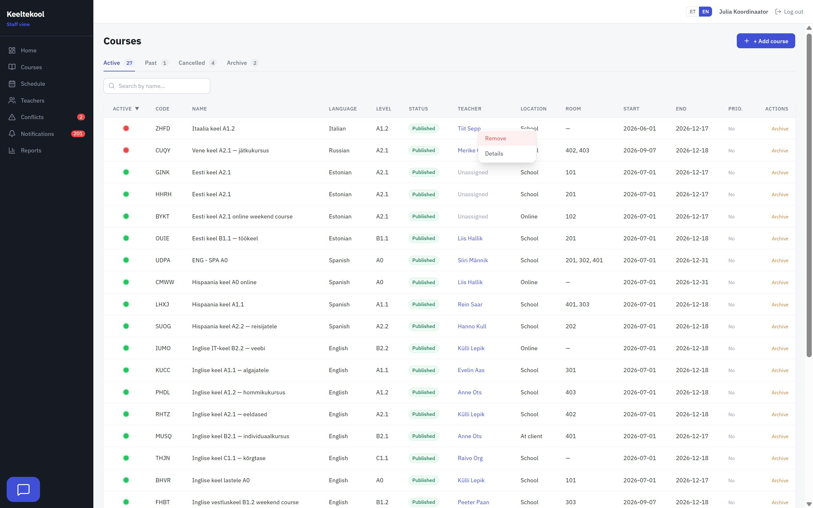
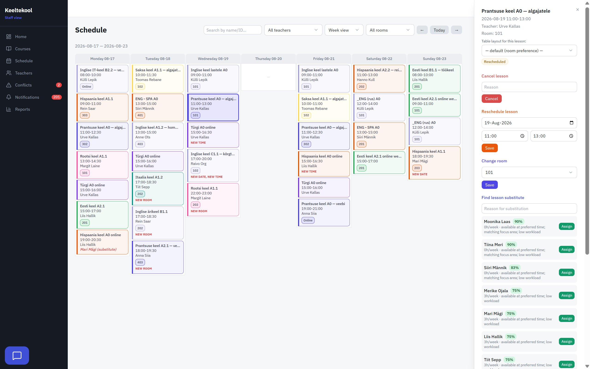
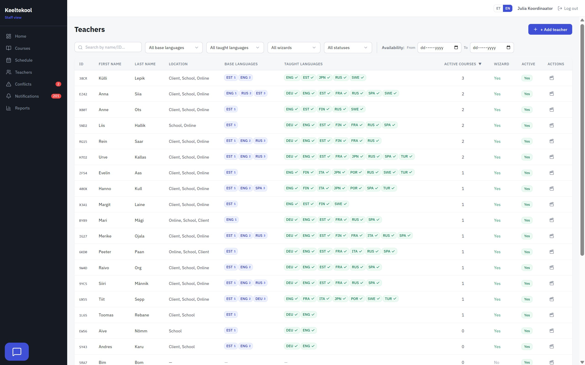
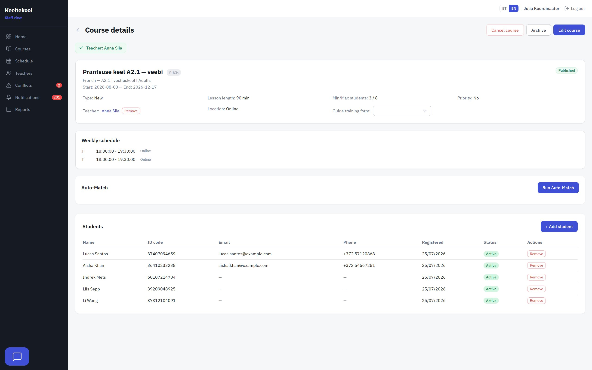
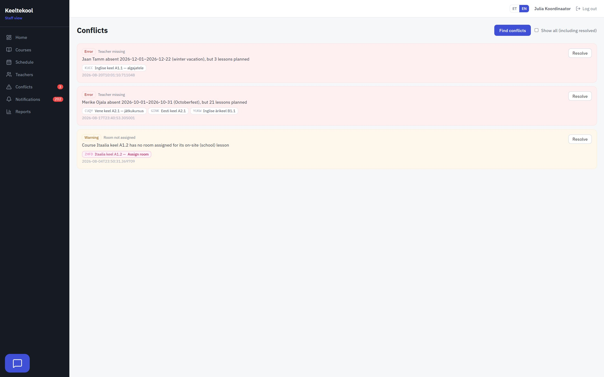
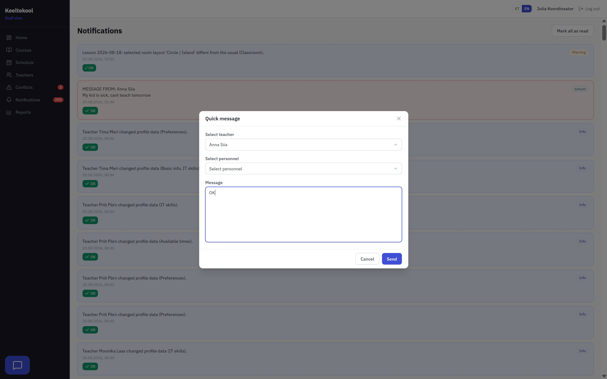
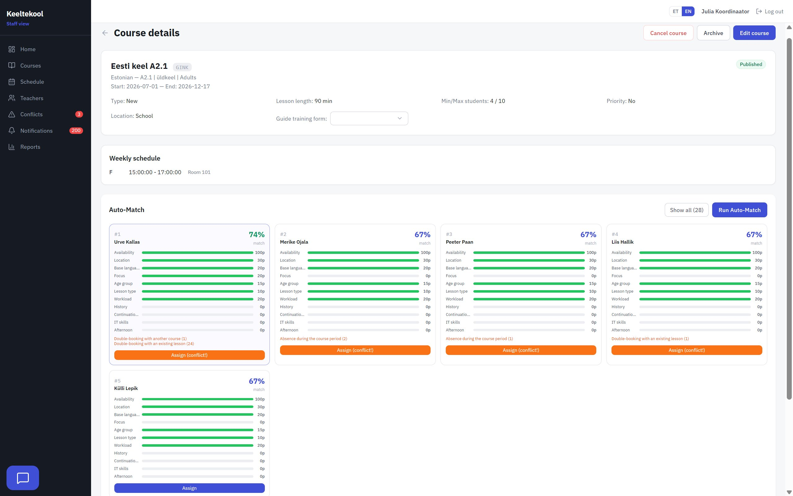

**Teacher views**

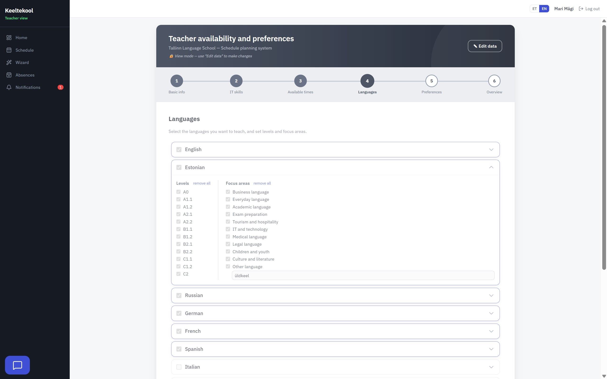
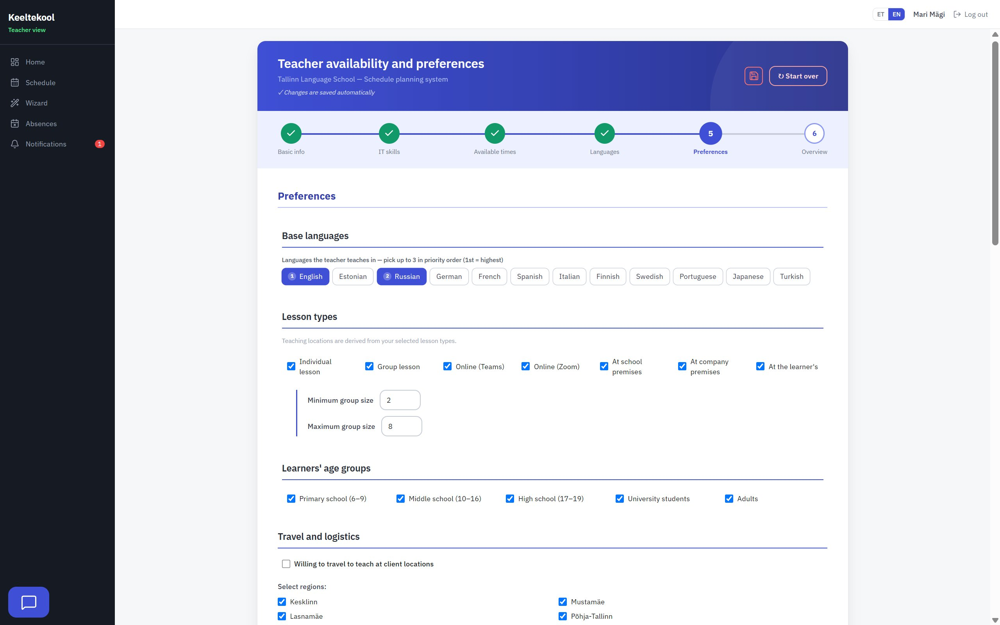

**Admin view**

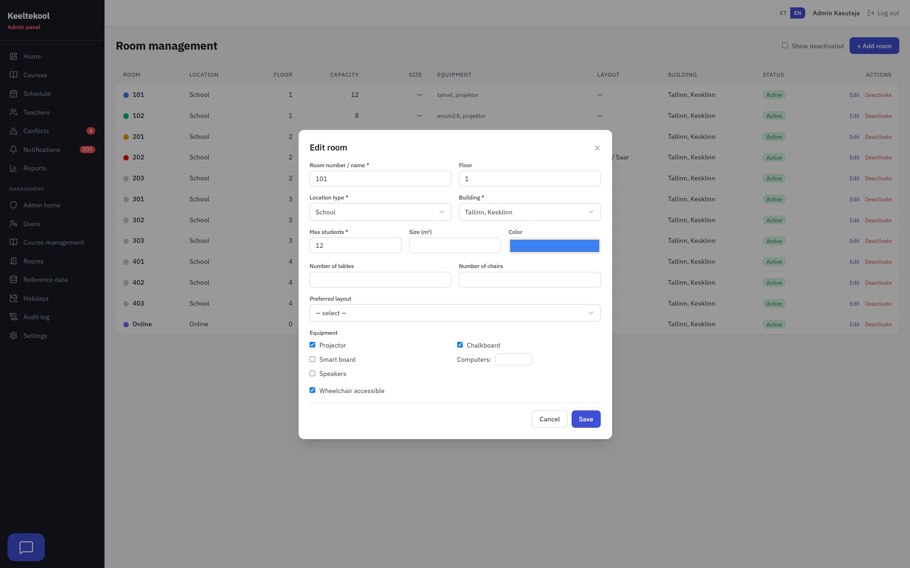

---

## 🎯 The problem it solves

Scheduling a language school by hand is a combinatorial headache: every course needs a teacher who speaks the right language at the right level, is available in the right time slots, isn't already double-booked, and fits the school's preferences (location, age group, focus area, workload).

This system turns that into a guided workflow — teachers insert their preferences and available times, staff plan courses, the engine **scores and ranks suitable teachers automatically**, and conflicts are surfaced before they reach the timetable.

> [!IMPORTANT]
> **Hours of planning and hard work — done in seconds.**

The entire domain is **Estonian-language** (a real-world requirement), with a fully **bilingual (ET/EN)** user interface and API.

---

## 👤 My role

This is being built during an ongoing internship, by me, as the only full-stack developer. I designed and implemented the backend layering, the auto-match scoring engine, conflict detection, the role-based auth model, the teacher-onboarding wizard, the notification/messaging system, and the bilingual (ET/EN) support — end to end. Only the base schema was proposed by a previous teammate, and it has since been reshaped to fit growing needs.

---

## ✨ Key features

- 🤖 **Auto-match engine** — scores every teacher **0–205** across eleven weighted dimensions (availability, location, base language, focus area, age group, lesson type, workload, teaching history, continuation bonus, IT skills, afternoon preference). Hard mismatches disqualify candidates.
- ⚡ **Conflict detection** — finds teacher double-bookings, absence overlaps, room double-bookings, and insufficient breaks; computed live without polluting the database. Conflicting edits are **allowed with a warning** (confirm-to-proceed), not hard-blocked.
- 🧙 **Guided teacher onboarding** — a six-step wizard (core data → IT skills → availability → languages → preferences → review), auto-saved as you type.
- 🔄 **Two-stage substitute flow** — a teacher who can't take a lesson first asks a *target* colleague; only after acceptance does it go to staff for final approval.
- 💬 **Quick messages & smart notifications** — direct messages to selected teachers/staff; hybrid notification model (per-account **and** role-broadcast, so new staff still sees history), with optional email delivery.
- 🔐 **Role-based access** — three roles (`admin`, `personal`, `opetaja`) enforced at both the API and the client router.
- 📅 **Timetable generation & data tools** — recurring weekly slots expand into lesson instances with rooms, substitutes, per-language colors, and web links; admin can regenerate or wipe the schedule from a guarded danger zone.
- 📊 **Reports & student enrollment** — staff reporting views (all CSV-exportable) and normalized, soft-deletable student enrollment with an audit trail.
- 🌍 **Bilingual (ET/EN)** — `vue-i18n` on the front end and `Accept-Language`-driven API; dynamic text (notifications, match reasons, conflict descriptions) composed from `(code, params)` so both languages stay in sync.

---

## 🛠 Tech stack

| Layer | Technology |
|---|---|
| **Frontend** | Vue 3.5 · Pinia 3 · Vue Router 4.5 · vue-i18n 10 |
| **Styling / Build** | Tailwind CSS 3.4 · Vite 6 |
| **Backend** | FastAPI 0.115 · SQLAlchemy 2.0 (async) · Pydantic v2 · Alembic 1.15 |
| **Database** | PostgreSQL · asyncpg |
| **Testing** | Vitest 4 · Pytest 9 · pytest-asyncio · httpx |
| **Infrastructure** | Docker (multi-stage) · Fly.io · axios 1.7 |

---

## 🏗 Architecture

The whole app ships as a **single deployable unit**: one Docker image, one process, one command to deploy. The FastAPI backend serves both the JSON API and the built Vue app — no separate frontend server to run or keep in sync.

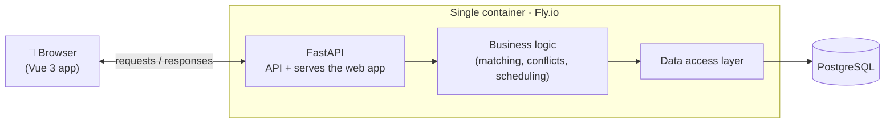

### How a request flows

A user action (say, *"find the best teacher for this course"*) passes through three clearly separated layers — each with one job:

- **🌐 API layer** — receives the request, checks authorization, and hands off. No business logic here.
- **⚙️ Logic layer** — the real work: matching engine, conflict checks, schedule generation, notifications.
- **🗄 Data layer** — the only part that talks to the database, using explicit, predictable queries.

### Security & roles

Three roles — **admin**, **school staff**, and **teacher** — enforced **twice, independently**: in the browser (UX) and on the server (real security boundary). Logins use signed tokens, passwords are hashed, and sensitive actions are rate-limited.

### Built-in reliability

- **🔁 Two languages, always in sync** — ET/EN generated from the same data; they can't drift.
- **🔒 Safe schema changes** — every DB change is a versioned migration, applied automatically on deploy.
- **✅ Tested** — backend logic and frontend components both have automated test suites.

---

## 🗺 Roadmap

**Done**

- [x] Requirement meetings with company owner
- [x] Teacher onboarding wizard (6-step)
- [x] Schema design and build
- [x] Staff (Personell) management page
- [x] Admin page
- [x] Auto-match scoring engine (0–205, configurable weights)
- [x] Conflict detection system
- [x] Bilingual UI — English added
- [x] Hybrid notifications + quick messages + two-stage substitute flow
- [x] Per-language schedule colors · admin schedule data-tools
- [x] Student enrollment (normalized, soft-deletable, audited)

**To do**

- [ ] Notification targeting UI (send to whole level / custom groups)
- [ ] Full backup / restore (schedule wipe shipped; full backup planned)
- [ ] Customization to client detailed needs

---

## 🔒 About this repository

The application's **source code is private** (developed for a real organization). This file introduces the architecture, features, and engineering decisions, alongside a **[live demo](https://keeltekool.fly.dev/)** running on anonymized data.
